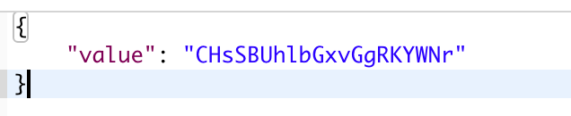

# SwiftVaporPB


简便的将SwiftProtobuf集成进Vapor项目中
# 引用项目中
```
.package(url: "https://github.com/apple/swift-protobuf.git", from: "0.0.1")

dependencies[..."SwiftVaporPB"]
```
# 使用
```
import SwiftVaporPB

router.get("pb") { (req:Request) -> EventLoopFuture<PB<BookInfo>> in
        let bookInfo =   BookInfo.with({ ( bookInfo:inout BookInfo) in
            bookInfo.id = 123
            bookInfo.author = "Jack"
            bookInfo.title = "Hello"
        })
         return try req.makePB(value: bookInfo)
    }
```
# 返回格式
```
struct PB<T> : Content where T: Message{
    var value: Data
    init(_ data: T) throws {
        self.value = try data.serializedData()
    }
}
```
从我们的定一种可以看出，我们只是进行一个简单的包装
结果参考：


